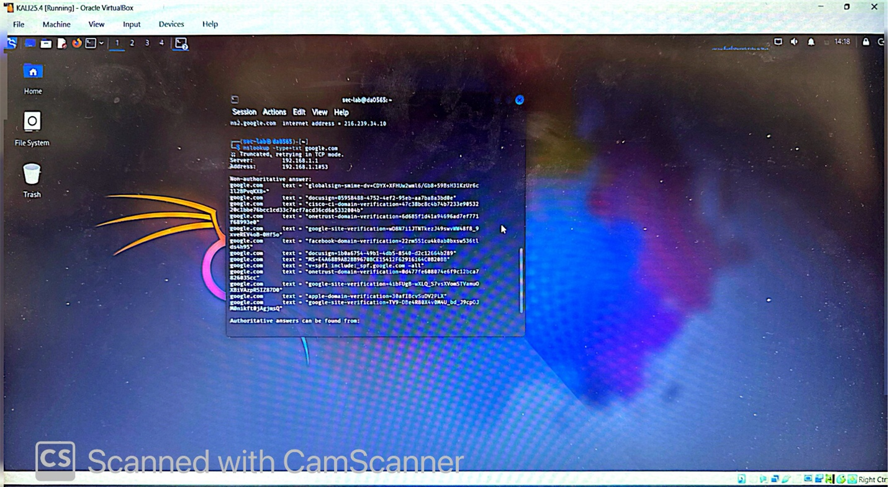
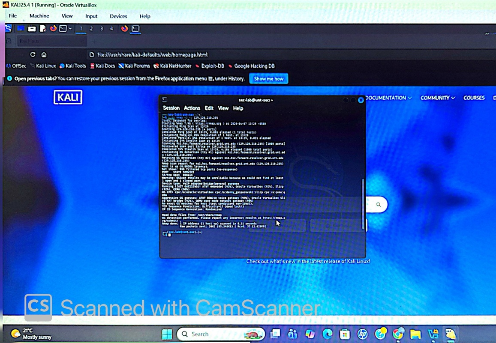
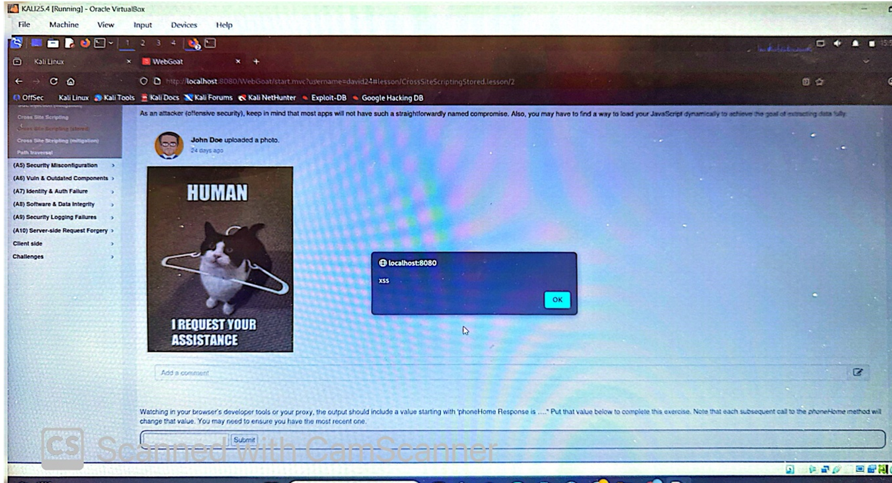
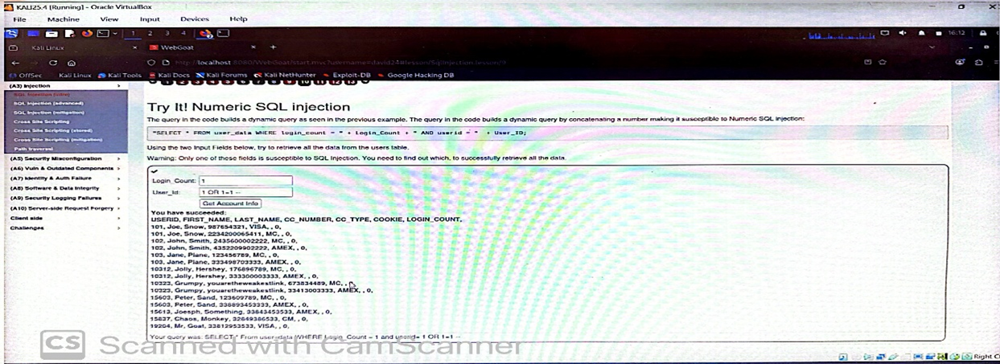
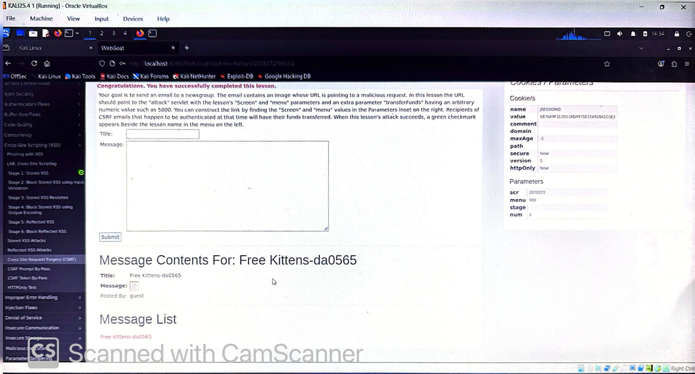
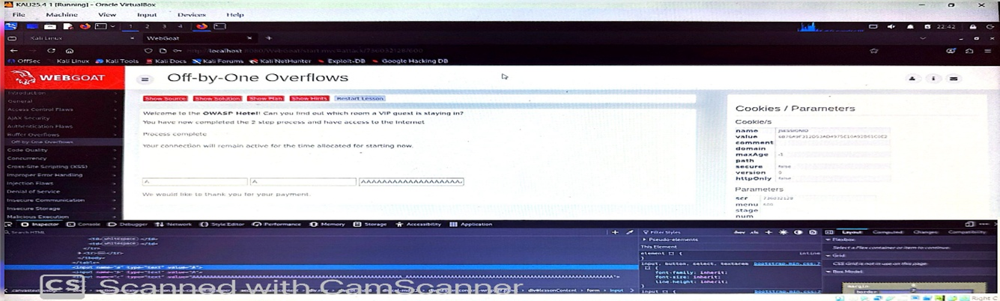

# lab2-information-gathering-webgoat-attacks
Information gathering and web application security testing using DNS analysis, Nmap scanning, and WebGoat vulnerability exploitation (XSS, SQL Injection, CSRF, Buffer Overflow).

## Objectives
- Perform DNS reconnaissance and record analysis
- Conduct network scanning using Nmap
- Understand attacker perspective in information gathering
- Exploit common web vulnerabilities using WebGoat
- Analyze security weaknesses in web applications

## Tools Used
- nslookup (DNS reconnaissance)
- Nmap (network scanning)
- WebGoat (OWASP security training platform)
- Kali Linux / Terminal

## Part 1: Information Gathering

### DNS Reconnaissance (nslookup)
- Retrieved A, AAAA, MX, NS, and TXT records for google.com
- Identified mail servers, name servers, and verification records
- Learned how DNS records expose infrastructure information

### Security Insight
DNS records can be used by attackers for:
- Identifying mail servers for phishing/spam attacks
- Mapping infrastructure and attack surfaces
- Discovering domain ownership and verification data

### Network Scanning (Nmap)
- Performed scan on UNT DNS server (129.120.210.235)
- Identified open port 53 (DNS service)
- Attempted OS detection using Nmap

### Security Insight
Nmap helps attackers:
- Identify open ports and services
- Map network infrastructure
- Plan targeted attacks based on exposed services

## Part 2: WebGoat Attacks

### Cross-Site Scripting (XSS)
- Injected script: ``
- Successfully executed in browser
- Demonstrated client-side code injection vulnerability

### SQL Injection
- Used payload: `1 OR 1=1--`
- Bypassed authentication
- Accessed sensitive user data

### Cross-Site Request Forgery (CSRF)
- Simulated malicious request with hidden form
- Demonstrated unauthorized action execution
- Showed risk of user session exploitation

### Buffer Overflow
- Input large string (6000+ characters)
- Caused memory overflow behavior
- Demonstrated risk of memory corruption attacks

## Screenshots

### DNS Reconnaissance

### Nmap Scan

### XSS Attack

### SQL Injection

### CSRF Attack

### Buffer Overflow

## What I Learned
- How attackers gather system information using DNS and network tools
- Real-world impact of misconfigured services
- How web vulnerabilities like XSS and SQL Injection work
- Importance of input validation and secure coding
- Basics of offensive cybersecurity techniques

## Security Conclusion
This lab demonstrates how attackers progress from information gathering to exploitation. Proper security controls such as input validation, secure configurations, and monitoring are essential to prevent these attacks.

## Skills Demonstrated
- Cybersecurity reconnaissance using DNS enumeration
- Network scanning and service identification using Nmap
- Web application penetration testing using WebGoat
- Exploitation of OWASP Top 10 vulnerabilities (XSS, SQL Injection, CSRF)
- Understanding of memory-based vulnerabilities (Buffer Overflow)

## Real-World Relevance
This lab demonstrates how attackers move from information gathering to exploitation. It highlights the importance of securing web applications, validating inputs, and protecting network services.

## Author
Denish Adhikari  
Cybersecurity Student | Information Security & Penetration Testing Fundamentals
